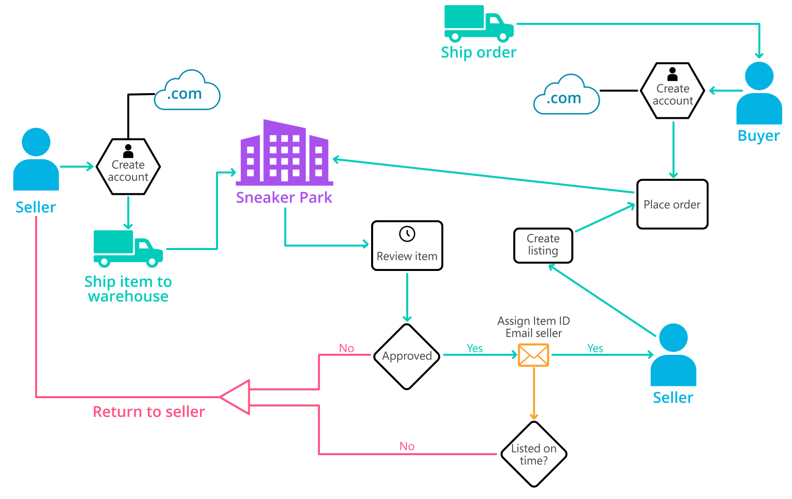

# Data Governance

## Business Background

SneakerPark is an online shoe reseller that allows people to buy and sell used and new shoes. Buyers can bid for shoes or buy them outright, and sellers can set a price or sell to the highest bidder.

Each buyer and seller must have an active account in order to sell, bid, or purchase sneakers using SneakerPark’s website.

SneakerPark authenticates the shoes before shipping them to the buyer, so before listing an item, the seller must ship it to SneakerPark’s warehouse. Upon receipt, SneakerPark assigns an item number to each pair of sneakers and notifies the seller that they are now free to list their item. If the item is not listed within 45 days, SneakerPark returns the sneakers to the seller and sends an invoice to the seller for the shipping cost.

If the item is found to be inauthentic or in an unacceptable condition, it is also returned back to the seller in a similar fashion.

When the item sells, the seller's account is credited with the purchase price minus the SneakerPark service fee and shipping fees to deliver the item to the buyer.

Currently, SneakerPark only supports sales within the United States.

The diagram below shows some of SneakerPark's business processes.

## Motivation
SneakerPark’s business has grown rapidly over the past year and it has led to some growing pains. As the number of sellers, buyers, items, and sales increased, the company started running into discrepancies between systems which resulted in mischarges, lost revenue, and frustrated customers. With this in mind, Sneaker Park has decided to invest in an Enterprise Data Management program to gain better visibility and control over their data systems.

Phase 1 of this initiative focuses on creating the foundational data management tools and artifacts that will allow SneakerPark to better manage their data now and in the future. More specifically, this entails documenting SneakerPark's data systems, setting up a data catalog, designing better data quality and master data management processes, and formalizing data governance roles.

This project focuses on the implementation of Phase 1.

The company plans to expand on this foundation in Phase 2 and build out an Enterprise Data Warehouse solution to replace the existing legacy data warehouse, MS Access databases, and excel reports. Phase 2 is a separate initiative and therefore is not a part of this project.

## Relevant Personnel
Two employees have been responsible for data management. The first of the two is Jake. His background is in IT support and for the past two years, he has been tasked with administering the databases that are behind the company's systems. Even though he's been able to keep the databases running, he spends more and more time fire-fighting and trying to fix all the data issues that have come up.

The second is Jessica, a senior business analyst who is a company veteran and a subject-matter-expert when it comes to Sneaker Park's data. She has been instrumental in diagnosing data issues and finding solutions, but successful as she is, it has been increasingly difficult to keep up as she does this in addition to her other responsibilities.

